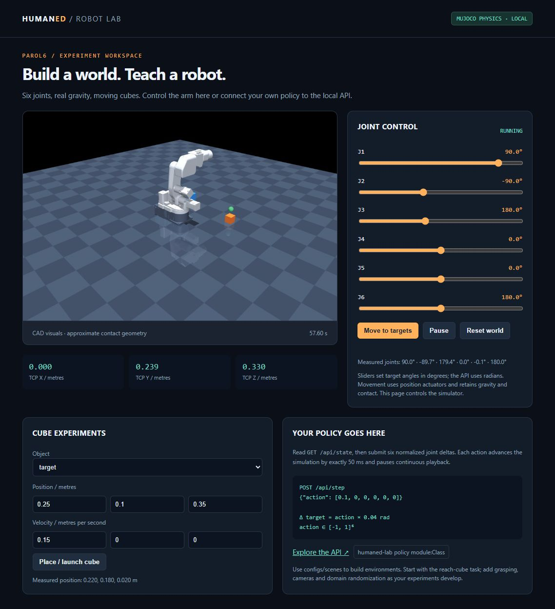

# HumanED Robot Lab

**A local PAROL6 physics simulator, browser controls, and an open interface for your own policies.**

Build scenes with moving cubes, gravity and contact. Control the arm manually, from Python or HTTP, then train and evaluate a policy in the same MuJoCo world. The robot uses the pinned PAROL6 URDF frames, native joint limits, masses and inertias, with the original CAD visuals.

**Branch:** `feat/parol6-simulation-lab` · **Python:** 3.12 · **Dashboard/API:** `http://127.0.0.1:8765`



## Start on another Windows computer

Install [Git](https://git-scm.com/downloads) and [uv](https://docs.astral.sh/uv/getting-started/installation/), then open PowerShell:

```powershell
git clone --branch feat/parol6-simulation-lab https://github.com/Takodachi696969/computer-vision.git
Set-Location computer-vision
.\scripts\bootstrap.ps1
.\.venv\Scripts\humaned-lab.exe serve
```

Open **[the dashboard](http://127.0.0.1:8765)**. Move a joint slider, click **Move to targets**, and place or launch a cube. Leave the server running while scripts use its API. Stop a foreground server with `Ctrl+C`.

The bootstrap installs Python, locked dependencies, PPO training and Hugging Face tooling. It requires no WSL, robot, camera or C++ compiler. Use `-Camera` to include the RealSense SDK, or `-CoreOnly` for simulation without training. On Linux run `bash scripts/bootstrap.sh`; headless rendering may need EGL/Mesa (`MUJOCO_GL=egl`). Windows is verified locally; the included Linux CI workflow awaits its first run.

For a background server on Windows, use `scripts/start-lab.ps1` and `scripts/stop-lab.ps1`. Stop the old server before changing its scene.

## Understand the system in a minute

| Component | Purpose | Where to edit |
|---|---|---|
| Physics | URDF → MuJoCo, actuators, rigid cubes, contact, rendering | `src/humaned_lab/simulation/` |
| Control | Shared world, browser, HTTP commands, Python client | `src/humaned_lab/control/` |
| Policies | `act(observation)` → six normalized joint deltas | `src/humaned_lab/policies/`, `examples/policies/` |
| Training | Gymnasium reach task, PPO, evaluation, checkpoints | `src/humaned_lab/training/` |
| Hardware | Optional RealSense capture and PAROL6 adapter | `src/humaned_lab/hardware/` |
| Environments | Masses, sizes, poses, velocities, friction, obstacles | `configs/scenes/` |

```text
computer-vision/
├── README.md                    # start here
├── pyproject.toml + uv.lock      # portable, locked installation
├── scripts/                     # bootstrap, start/stop, optional upstream setup
├── configs/scenes/               # editable JSON physical environments
├── src/humaned_lab/
│   ├── simulation/               # physics + packaged PAROL6 model assets
│   ├── control/                  # API + browser + Python client
│   ├── policies/                 # extension contract and PPO adapter
│   ├── training/                 # environment, train/evaluate, Hub helpers
│   └── hardware/                 # optional robot/camera adapters
├── examples/                     # control, scenes, policies and trained checkpoint
├── tests/                        # physics, API and training verification
├── docs/                         # overview, tutorial, findings, provenance
├── outputs/                      # your runs, images and logs (ignored by Git)
└── week-1.ipynb                  # original team exercise, preserved
```

PAROL6's upstream package is the robot command stack: client → UDP commands → planner → 100 Hz controller → serial firmware or mock transport. Its mock simulator exercises commands. **MuJoCo supplies this lab's physical environment.** RealSense supplies images/depth from a connected camera. Read [the concise architecture map](docs/architecture.md) and [verified upstream problems](docs/problems.md).

## Control it, write a policy, train it

All commands run from the repository root. Keep `serve` running for HTTP examples and live policies.

```powershell
# Command the shared world from Python
.\.venv\Scripts\python.exe examples/control/joint_commands.py

# Customize the environment on another port
.\.venv\Scripts\humaned-lab.exe serve --port 8766 --scene configs/scenes/moving_cubes.json

# Run your editable policy through the simulation port
.\.venv\Scripts\humaned-lab.exe policy examples.policies.my_policy:MyPolicy --steps 200

# Train in a separate, faster-than-real-time world; the server is optional
.\.venv\Scripts\humaned-lab.exe train --steps 100000 --output outputs/my-policy
.\.venv\Scripts\humaned-lab.exe evaluate outputs/my-policy --episodes 20 --seed 20000

# Play the included trained policy on the dashboard
.\.venv\Scripts\humaned-lab.exe policy humaned_lab.policies.sb3:PPOPolicy --model examples/checkpoints/ppo-reach/model.zip
```

The included PPO reached its target in **96/100 held-out episodes** after 100,096 training steps; random control passed 0/100 and scripted IK 100/100. This measures reaching above a cube with a bare flange. See [the checkpoint's model card](examples/checkpoints/ppo-reach/README.md) for seeds, metrics and limits.

The API uses **metres, radians, seconds and wxyz quaternions**. A policy receives joint state, tool position, target and cube velocity, then returns six values in `[-1,1]`. Each action adds up to `0.04` rad to measured joints, clips to URDF limits and advances `0.05` simulated seconds. `/api/step` pauses continuous playback; resume from the dashboard afterwards. Inspect all endpoints at [localhost `/docs`](http://127.0.0.1:8765/docs).

Read the **[detailed hands-on tutorial](docs/tutorial.md)** for manual control, PowerShell commands, custom scenes, Python policies, training/evaluation, Hugging Face models, RealSense and physical robot setup. The [policy examples guide](examples/policies/README.md) covers the extension interface.

## Optional robot controller and camera

Install the original PAROL6 command stack in a separate environment with `scripts/setup-upstream.ps1`. It pins commit `b741d505ae9d1e3f28bd4ff4d0227b58b4921ed4`. On Windows, upstream TOPPRA needs **Microsoft C++ Build Tools**, or use Linux/WSL. This lab does not distribute the earlier locally built wheel. `upstream-smoke` homes and moves an owned mock controller; `bridge` reads upstream angles into physics. The tutorial includes commands and the hardware opt-in example.

```powershell
.\scripts\bootstrap.ps1 -Camera
.\.venv\Scripts\humaned-lab.exe camera list
.\.venv\Scripts\humaned-lab.exe camera capture --output outputs/realsense
```

No camera was detected on the development machine. Physical motors have not been commissioned or tested. The browser service controls simulation.

## Model boundaries and extension points

- Cubes have mass, rotation, gravity, friction and contact. Robot links use URDF inertias and position actuators; visual meshes retain the robot's shape.
- Robot contact proxies and servos are approximate; self-contact is disabled. Upstream inertias are uncalibrated. Position IK does not plan collision-free paths.
- The task **reaches above a cube**. Add your gripper, observations and rewards before training grasping or pick-and-place; there is no hidden grasp attachment.
- Hub models need matching observations, joint order, tool frames, action units and timing. The tutorial covers compatible SB3 reuse and the separate LeRobot fine-tuning route.

## Verify and extend

```powershell
.\.venv\Scripts\humaned-lab.exe doctor
.\.venv\Scripts\python.exe -m pytest -q
.\.venv\Scripts\ruff.exe check .
.\.venv\Scripts\humaned-lab.exe demo --output outputs/demo
```

See [verification evidence](docs/verification.md), [skills used](docs/skills.md), and [third-party notices](THIRD_PARTY_NOTICES.md). New lab code and PAROL6 model assets use GPL-3.0-only. The original team notebook retains its pre-existing ownership/licensing status.
