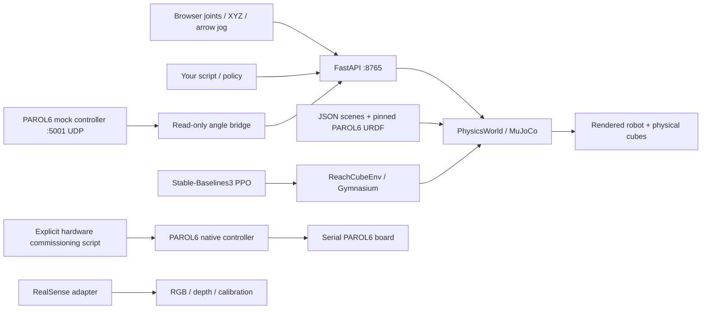

# Architecture in one page

This repository gives PAROL6 a local physics world, an HTTP control port, a browser panel, and a small policy contract. Start with [the tutorial](tutorial.md); [physics controls](physics-controls.md) explains material, motor and Cartesian experiments, and the [audit](problems.md) records limits and upstream issues.

## Where to change things

| Location | Responsibility | Change this for… |
|---|---|---|
| `src/humaned_lab/cli.py` | One command entry point | A new user command |
| `src/humaned_lab/simulation/model.py` | URDF → MuJoCo XML, contact proxies, actuators | Robot physics or contact geometry |
| `src/humaned_lab/simulation/world.py` | Reset, integrate, render, material/actuator edits, IK and telemetry | New world operations |
| `src/humaned_lab/simulation/world.py::_scene_config` | Validate/load scene descriptions | New physical scene fields |
| `src/humaned_lab/control/server.py` | Local HTTP API, simulation loop and locking | A new remote control operation |
| `src/humaned_lab/control/dashboard.html` | Browser controls and rendered image | The manual interface |
| `src/humaned_lab/control/client.py` | `SimulationClient` | A reusable Python API |
| `src/humaned_lab/policies/base.py` | Observation/action contract | A deliberately versioned policy interface |
| `src/humaned_lab/policies/sb3.py` | Load this lab's PPO checkpoints | Checkpoint inference |
| `src/humaned_lab/training/env.py` | Task, observations, reward, episode boundaries | A new RL problem |
| `src/humaned_lab/training/train.py` | Seeded PPO training and evaluation | Hyperparameters and experiment recording |
| `src/humaned_lab/hardware/` | Optional RealSense and explicit PAROL6 adapters | Sensors or hardware commissioning |
| `examples/policies/` | Editable controller examples | Your own policies |
| `configs/scenes/` | Cubes, obstacles, gravity, initial velocities | Your own environment |
| `scripts/`, `pyproject.toml`, `uv.lock`, `requirements/upstream-constraints.txt` | Core install/launch and separate optional upstream versions | Reproducing another computer |
| `outputs/` | Ignored renders, checkpoints, experiment metadata | Local generated results |
| `docs/` | Tutorial, architecture, audit, verification | Understand what is implemented |

Public simulation units are metres, radians, kilograms and seconds. Six normalized policy actions become joint target increments of `0.04 * action` radians per 50 ms control step. Position servos then move the simulated joints. This is a joint target policy interface; it does not expose learned motor torques. The current task reaches above a cube; it has no gripper or grasp-success criterion.

## What comes from the two upstream repositories

**PAROL6**, audited at `b741d505ae9d1e3f28bd4ff4d0227b58b4921ed4`, is a Python command/controller stack. `parol6/client/{sync_client,async_client}.py` expose commands; `protocol/wire.py` defines their MessagePack/UDP contract; `server/controller.py` runs the control loop; `server/motion_planner.py` plans trajectories outside that loop; `motion/` implements TOPPRA/Ruckig and other motion profiles; `server/transports/` selects serial hardware or mock telemetry; `PAROL6_ROBOT.py`, `config.py`, `tools.py` and `urdf_model/` describe robot geometry, limits and tool transforms. The lab bundles the pinned URDF and seven visual meshes, preserving their license. Its MuJoCo world is independent of upstream's mock serial simulation. [Pinned source](https://github.com/PCrnjak/PAROL6-python-API/tree/b741d505ae9d1e3f28bd4ff4d0227b58b4921ed4).

**librealsense**, audited at `e15c5d6bb1563e778d116f682aeefffbae2daedc` (source SDK 2.58.4), is a C/C++ depth-camera SDK. `include/librealsense2/` contains the public API, `src/` device/backend/processing implementation, `wrappers/python/` the `pyrealsense2` binding, `examples/` usage examples, and `tools/realsense-viewer/` the desktop viewer. Here the optional Python wheel supplies acquisition; the C++ checkout is a reference, not a required source build. The canonical organization is now `realsenseai`. [Pinned source and migration notice](https://github.com/realsenseai/librealsense/tree/e15c5d6bb1563e778d116f682aeefffbae2daedc).

## Fidelity boundary

Joint origins, axes, ranges, masses, centre-of-mass locations and inertia tensors come from the PAROL6 URDF. Visual STL meshes are separate from coarse primitive collision shapes. MuJoCo integrates gravity and rigid-body contact for cubes and obstacles; servo gains, damping and collision proxies are lab approximations. Cube dimensions, mass, local COM, friction and requested bounce can be edited; supported mechanism flags allow controlled ablation. Robot self-collision remains disabled. The six default 300 Nm caps come from generic URDF effort entries, not measured motor capability. Position-only IK and joint-interpolated waypoints do not enforce tool orientation or plan collision-free Cartesian paths. Camera-to-robot calibration, firmware delays, stepper behaviour, compliant fingers, fracture, grasping and physical policy deployment remain separate engineering work. See [physics controls](physics-controls.md), [asset provenance](../src/humaned_lab/simulation/assets/parol6/PROVENANCE.md) and [MuJoCo's model reference](https://mujoco.readthedocs.io/en/stable/XMLreference.html).
